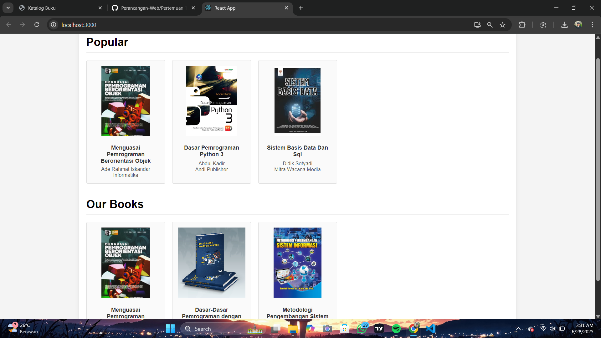

# Web Portofolio Pribadi

Ini adalah proyek website portofolio yang saya buat sebagai tugas Ujian Akhir Semester (UAS) untuk mata kuliah **Perancangan Web** di semester 2.

Website ini dibangun menggunakan ReactJS dan Vite, dan isinya adalah perkenalan diri saya, beberapa proyek tugas kuliah yang pernah saya buat, serta keahlian yang sedang saya pelajari.

**Live Demo bisa diakses di sini:**
**https://portofolio-haikalsrg.vercel.app/**

---

### Tampilan Proyek




### Teknologi yang Digunakan

* **Framework:** ReactJS + Vite
* **Bahasa:** JavaScript, HTML, CSS
* **Styling:** CSS Murni dengan CSS Variables & Media Queries untuk tampilan responsif.
* **Fitur Tambahan:**
    * **React Icons:** Untuk ikon-ikon di website.
    * **Formspree:** Untuk membuat formulir kontak berfungsi.
* **Hosting:** Vercel

### Cara Menjalankan Proyek Secara Lokal

1.  **Clone repository ini:**
    ```bash
    git clone [https://github.com/mhdhkl7/my-portofolio.git](https://github.com/mhdhkl7/my-portofolio.git)
    ```
2.  **Masuk ke direktori proyek:**
    ```bash
    cd my-portofolio
    ```
3.  **Install semua dependency yang dibutuhkan:**
    ```bash
    npm install
    ```
4.  **Jalankan development server:**
    ```bash
    npm run dev
    ```
5.  Buka browser dan akses `http://localhost:5173` (atau alamat lain yang muncul di terminal).

---

Terima kasih sudah berkunjung!
